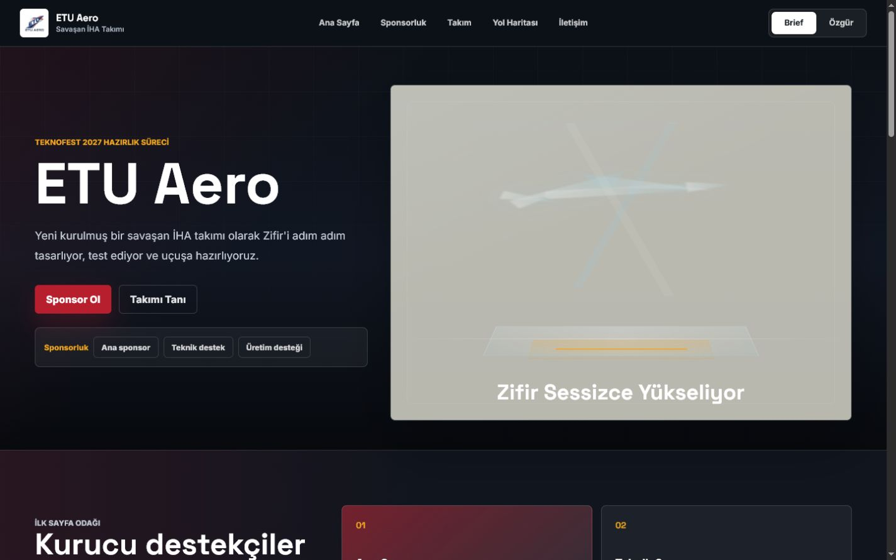
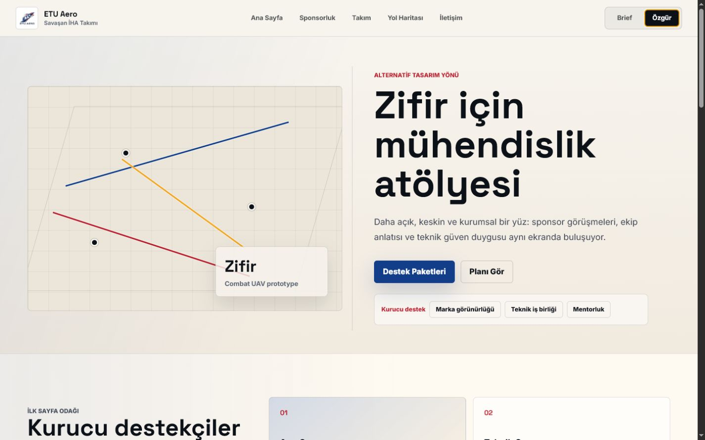
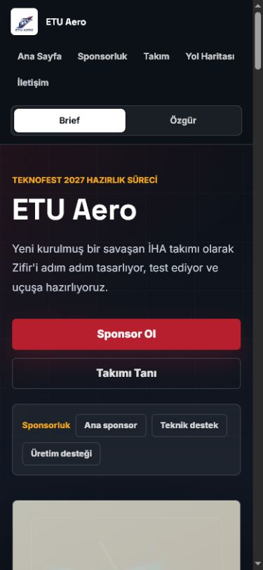
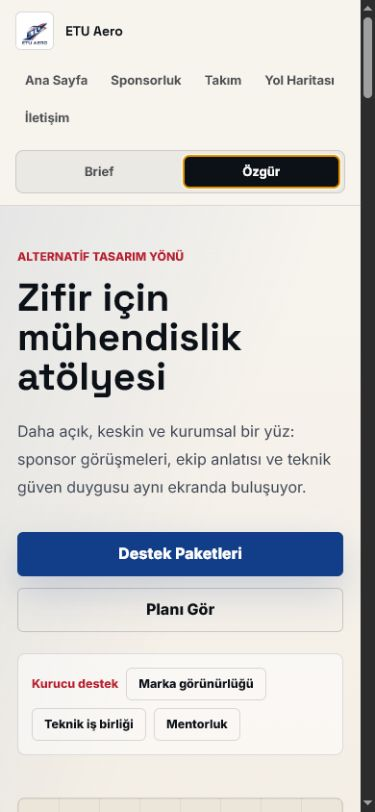

# ETU Aero | Zifir Web Sitesi

ETU Aero Teknofest Savaşan İHA takımı için hazırlanmış iki konseptli statik web sitesi tasarımıdır. Site, yeni kurulmuş bir takımın sponsor görüşmelerinde kullanabileceği premium bir vitrin ve Zifir projesi için "yakında geliyor" hissi veren bir ilk ekran üzerine kuruldu.

## Önizleme

Projeyi yerelde çalıştırmak için:

```bash
python -m http.server 4305 --bind 127.0.0.1
```

Ardından tarayıcıdan açın:

```text
http://127.0.0.1:4305/
```

## Tasarım Konseptleri

- **Brief:** Kullanıcı isteğine daha yakın, karanlık hangar/stage atmosferi, belirsiz Zifir İHA silüeti ve ilk ekranda sponsor çağrısı.
- **Özgür:** Daha açık, teknik ve kurumsal bir mühendislik atölyesi yaklaşımı.

## Ekran Görüntüleri

### Brief - Desktop



### Özgür - Desktop



### Brief - Mobil



### Özgür - Mobil



## Dosya Yapısı

```text
.
├── index.html
├── styles.css
├── script.js
├── README.md
└── assets/
    ├── etu-aero-logo.jpeg
    └── screenshots/
        ├── brief-desktop.png
        ├── ozgur-desktop.png
        ├── brief-mobile.png
        └── ozgur-mobile.png
```

## Takım Üyelerini Güncelleme

Takım kartları `script.js` içindeki `teamMembers` listesinden yönetilir. Gerçek üye isimleri, görevleri, fotoğraf yolları ve sosyal medya bağlantıları bu alana eklenebilir.

Örnek fotoğraf alanı:

```js
{
  name: "Ad Soyad",
  role: "Aviyonik",
  focus: "Uçuş bilgisayarı ve sensör füzyonu.",
  initials: "AS",
  image: "assets/team/ad-soyad.jpg",
  links: {
    in: "https://linkedin.com/in/kullanici",
    gh: "https://github.com/kullanici",
    mail: "mailto:contact@etuaero.org"
  }
}
```

## Notlar

- Proje framework kullanmaz; HTML, CSS ve JavaScript ile statik olarak çalışır.
- Logo `assets/etu-aero-logo.jpeg` içinde tutulur.
- İlk sayfada sponsor çağrısı özellikle görünür bırakılmıştır.
- Zifir tasarımı belli olmadığı için hero alanında kasıtlı olarak düşük detaylı, karanlık bir İHA silüeti kullanılmıştır.
