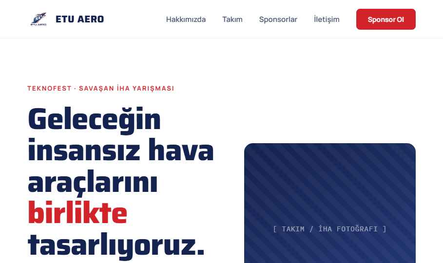

# ETU AERO — Konsept 02: Kurumsal Beyaz

Teknofest **Savaşan İHA** takımı ETU AERO için tanıtım + sponsor web sitesi.
Bu klasör, 5 konsept arasından **02 — Kurumsal Beyaz** yönünün tam sayfa uygulamasıdır.

## Önizleme

| Hero | Hakkımızda |
|---|---|
|  |  |

| Sponsorlar | İletişim |
|---|---|
|  |  |

## Konsept

- **Hava:** Temiz, güvenilir, bol beyaz alan; kurumsal ve minimal — sponsora güven veren yön.
- **Renk:** Beyaz zemin (#ffffff), lacivert yapı (#14224f), kırmızı vurgu (#d2232a).
- **Tipografi:** Saira (başlık) + Manrope (gövde).
- **Animasyon:** Düşük — yalnızca yumuşak hover/fade.

## Bölümler

Tek sayfa, sticky nav ve smooth-scroll anchor'larla:
`Hero` · İstatistik şeridi · `Hakkımızda` · `Takım` (8 kart) · `Sponsorlar` (logo gridi + Gümüş/Altın/Platin paketleri) · `İletişim` (lacivert bölüm + form) · Footer.

## İçerik / placeholder

Gerçek veriyle değiştirilecek alanlar `index.dc.html` içindeki `renderVals()` bloğunda:
- `members[]` — üye ad + rol (şu an "Ad Soyad" placeholder).
- `sponsors[]` — 10 boş sponsor slotu.
- İletişim: `info@etuaero.com`, `@etuaero` — gerçek bilgilerle güncelleyin.
- Görseller: `[ TAKIM / İHA FOTOĞRAFI ]`, `[ FOTO ]` placeholder kutuları.

## Çalıştırma

`index.dc.html` bu tasarım ortamının Design Component formatıdır (inline-style). Üretime taşırken kök dizindeki **`handoff.md`** dosyasındaki teknik notları izleyin (stack, responsive breakpoint'ler, form backend, SEO).

---
© 2026 ETU AERO · Eskişehir Teknik Üniversitesi · Savaşan İHA
