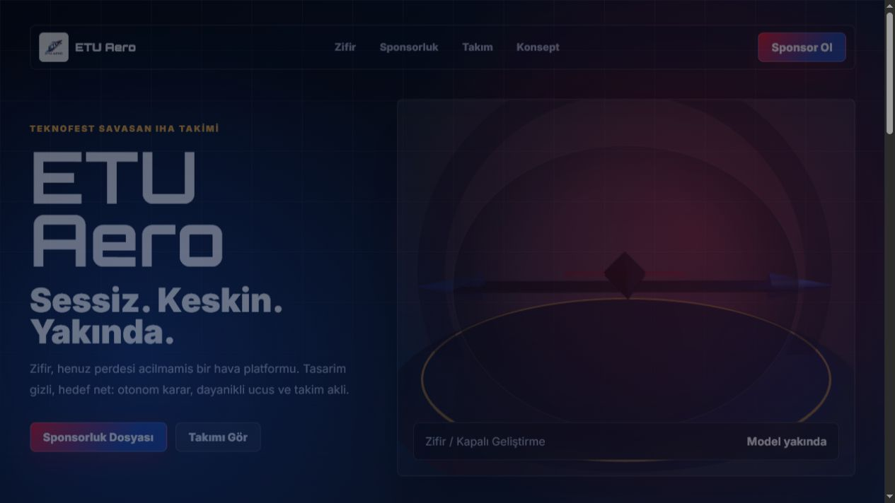

# ETU Aero Website

ETU Aero icin hazirlanan statik tanitim sitesi. Site, Teknofest Savasan IHA kategorisine hazirlanan takimin Zifir projesini futuristik bir dille anlatir; ana sayfada sponsor cagri alani, karanlik 3D IHA silueti, takim sayfasi ve alternatif konsept tasarim bulunur.



## Sayfalar

- `index.html`: Ana tasarim, Zifir sahnesi ve sponsorluk bolumu.
- `concept.html`: Daha ozgur, radar/gorev konsolu hissinde alternatif tasarim.
- `team.html`: Takim uyeleri ve sosyal medya baglantilari icin hazir kart yapisi.

## Calistirma

Bu proje build adimi gerektirmez. Klasor icinde basit bir statik sunucu acmak yeterlidir:

```bash
python -m http.server 5174
```

Sonra tarayicida ac:

```text
http://127.0.0.1:5174/index.html
```

## Deploy

Statik dosyalardan olustugu icin GitHub Pages, Netlify, Vercel veya herhangi bir statik hosting ile kolayca yayinlanabilir. Ana giris dosyasi `index.html` olmalidir.

## Notlar

- 3D sahne Three.js CDN uzerinden yuklenir.
- `assets/etu-aero-logo.jpeg` takim logosudur.
- `assets/screenshot-home.png` README icin kullanilan ana sayfa ekran goruntusudur.
- Takim uyeleri kesinlesince `team.html` icindeki placeholder isim, fotograf ve sosyal medya linkleri guncellenebilir.
