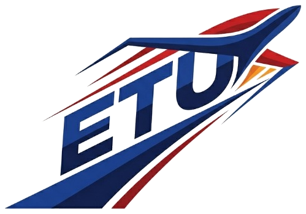
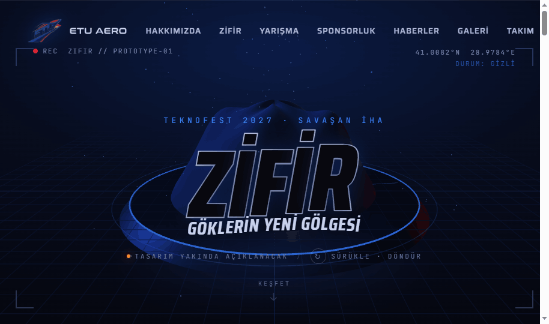
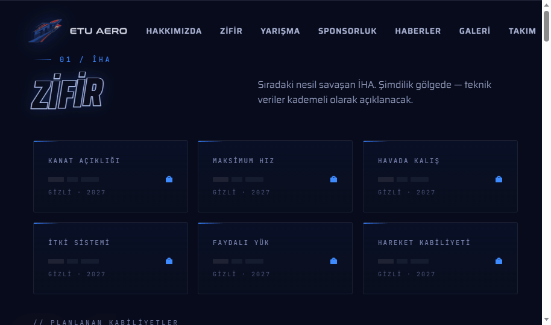
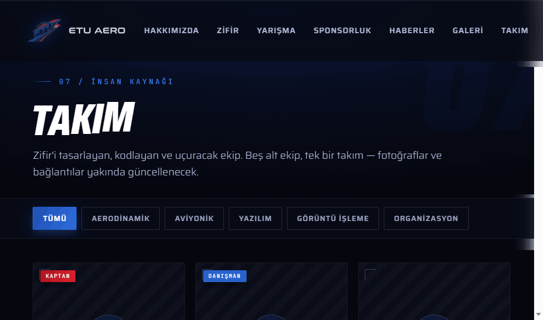
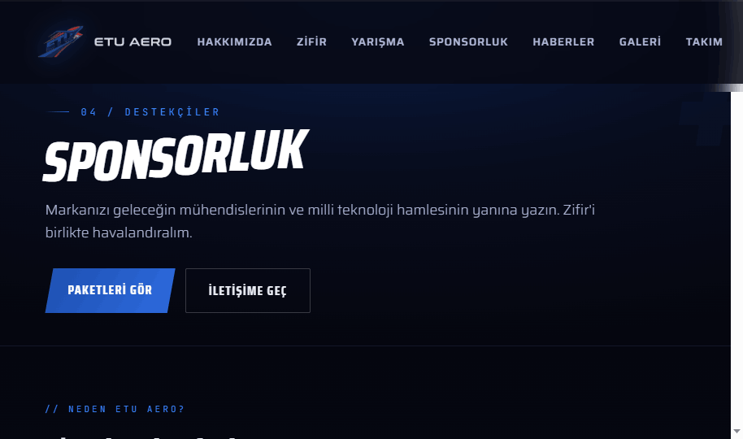

<div align="center">



# ETU AERO · ZİFİR

### Göklerin Yeni Gölgesi

**TEKNOFEST 2027 — Savaşan İHA** kategorisine hazırlanan ETU Aero takımının resmî web sitesi.

</div>

---

## 🚀 Hakkında

ETU Aero, insansız hava araçları üzerine çalışan, yeni kurulmuş bir üniversite takımıdır. İlk İHA'mız **Zifir**, otonom hava muharebesinde gökyüzünün en sessiz, en hızlı gölgesi olmak için tasarlanıyor.

Bu site; sürükle-döndür özellikli **3B tanıtım sahnesi**, sponsorluk paketleri, tıklanınca açılan detay kartlı takım tanıtımı, yarışma yol haritası ve galeri bölümlerini içeren, tamamen statik (sunucu gerektirmeyen) bir web sitesidir.

---

## 🖼️ Ekran Görüntüleri

### Ana Sayfa — 3B Tanıtım Sahnesi
> Karanlık bir stand üzerinde, örtüyle gizlenmiş Zifir prototipi. Fareyle sürükleyip döndürebilirsiniz.



### İHA Zifir — Teknik Künye


### Takım


### Sponsorluk


---

## 🎨 Tasarım Sistemi

Tüm site, takım logosuyla **bütünleşik** bir tasarım sistemi üzerine kuruludur:

- **Renkler:** Logodan örneklenen derin lacivert, elektrik mavisi ve kırmızı; turuncu "ateş" vurguları. Başlık renk geçişleri **mavi → turuncu → kırmızı**.
- **Tipografi:** Logodaki "AERO" yazısının akışkan/dalgalanan karakterinden esinlenen, harf harf dalgalanan başlık imzası (Saira Condensed).
- **Hareket:** Apple tarzı, aşağı kaydırdıkça beliren bölümler ve paralaks; yüksek enerjili, savunma-teknoloji estetiği.

---

## 📂 Dosya Yapısı

```
├── index.html              → ana sayfaya yönlendirir
├── ETU Aero.dc.html        → Ana sayfa (3B sahne + tüm bölümler)
├── Takim.dc.html           → Takım sayfası (14 üye, 4 departman filtresi, detay kartları)
├── Sponsorluk.dc.html      → Sponsorluk detay sayfası
├── support.js              → çalışma zamanı (gerekli)
├── assets/                 → logo ve amblem görselleri (gerekli)
├── docs/                   → DEPLOY.md — yayına alma rehberi
└── screenshots/            → README görselleri
```

> **Not:** `.dc.html` dosyaları `support.js` ve `assets/` klasörüne ihtiyaç duyar — hepsini birlikte yükleyin.

---

## 🌐 Yayına Alma

Site tamamen statik dosyalardan oluşur; kurulum gerektirmez. En kolay yollar:

- **GitHub Pages** (önerilen, ücretsiz, kalıcı)
- **Netlify Drop** (klasörü sürükle-bırak, en hızlı)
- **Vercel**

İkisi de dakikalar içinde yayına alır. Adım adım anlatım, kontrol listesi ve sorun giderme için:

➡️ **[docs/DEPLOY.md](docs/DEPLOY.md)** — tam yayına alma rehberi

> **Özet (GitHub Pages):** Depoyu oluştur → tüm dosyaları yükle → **Settings → Pages** → Branch: `main` → **Save**. Birkaç dakikada `https://<kullanıcı>.github.io/<depo>/` adresinde yayında.

> ⚠️ `support.js` ve `assets/` klasörünü diğer dosyalarla **aynı yere** yükleyin; dosya adlarını değiştirmeyin.

---

## ✏️ Güncellenecek İçerikler

Şu an yer tutucu (placeholder) olan ve sizin doldurmanız gereken alanlar:

- [ ] Takım üyelerinin fotoğrafları
- [ ] Sosyal medya hesap bağlantıları (Instagram, LinkedIn, YouTube — logolar hazır, linkler eklenecek)
- [x] ~~Takım üye bilgileri~~ — 14 üye Excel'den işlendi; kaptan (kırmızı) + bölüm kaptanları (mavi) rozetleri, tıklanınca detay kartı ✓
- [x] ~~İletişim bilgisi~~ — Takım kaptanı Eren Can Dönertaş (e-posta + telefon), TOBB ETU · Ankara ✓
- [x] ~~Sponsor logoları~~ — henüz sponsor yok; "ilk destekçimiz siz olun" daveti eklendi ✓
- [ ] Haber/duyuru görselleri ve galeri fotoğrafları

---

<div align="center">

**ZİFİR · GÖKLERİN YENİ GÖLGESİ**

© 2026 ETU AERO

</div>
