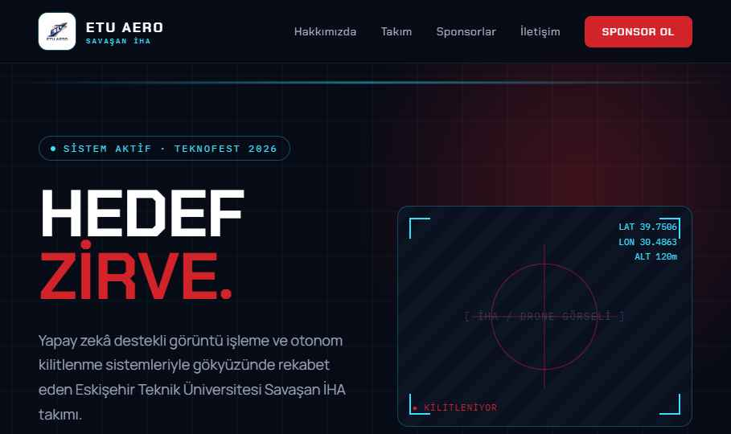

# Alacakaranlık — Koyu Komuta Merkezi

Teknofest **Savaşan İHA** takımı Alacakaranlık ve İHA'sı **Zifir** için tanıtım + sponsor web sitesi.

## Önizleme

| Hero | Hakkımızda |
|---|---|
|  |

## Konsept

- **Hava:** Taktik HUD / komuta merkezi estetiği; yüksek teknoloji, fütüristik.
- **Renk:** Koyu lacivert zemin (#070b16), kırmızı vurgu (#d2232a), cyan teknoloji aksanı (#38e0ff).
- **Tipografi:** Chakra Petch (başlık) + IBM Plex Mono (telemetri/etiket) + Manrope (gövde).
- **Animasyon:** Yüksek — HUD tarama çizgisi, nişangah pulse, hareketli grid, blink. `prefers-reduced-motion` ile kapatılır.

## Sayfa yapısı

Site çok sayfalıdır; tüm sayfalar ortak sticky nav + footer kullanır:

| Sayfa | Dosya | İçerik |
|---|---|---|
| Ana Sayfa | `Alacakaranlik.dc.html` | 3D hero, manifesto, Zifir & takım teaser'ları, sponsor çağrısı |
| Hakkımızda | `Hakkimizda.dc.html` | Takım tanıtımı, istatistikler, haberler, galeri |
| Zifir | `Zifir.dc.html` | İHA teknik veriler, kabiliyetler, yarışma yol haritası (`#yarisma`) |
| Takım | `Takim.dc.html` | Üye kartları, departman filtresi, detay overlay |
| Sponsorluk | `Sponsorluk.dc.html` | Neden sponsor, paketler (`#paketler`), iletişim formu (`#iletisim`) |
| Test Uçuşu | `oyun.html` | Mini oyun |

`index.html` ana sayfaya yönlendirir.

## İçerik / placeholder

Gerçek veriyle değiştirilecek alanlar:
- `Takim.dc.html` → `roster()` — üye bilgileri.
- `Sponsorluk.dc.html` — sponsor slotları.
- Görseller: haber kartları ve galeri `GÖRSEL` placeholder kutuları.
- Marka görselleri: `assets/alacakaranliklogo.png` (amblem) ve `assets/alacakaranlikisim.png` (wordmark). Eski ETU AERO logoları kaldırıldı.

## Çalıştırma

`*.dc.html` dosyaları bu tasarım ortamının Design Component formatıdır (inline-style, `support.js` ile çalışır). Üretime taşırken kök dizindeki **`handoff.md`** dosyasındaki teknik notları izleyin (stack, responsive breakpoint'ler, form backend, SEO).

---
© 2026 Alacakaranlık · TOBB ETÜ · Savaşan İHA
