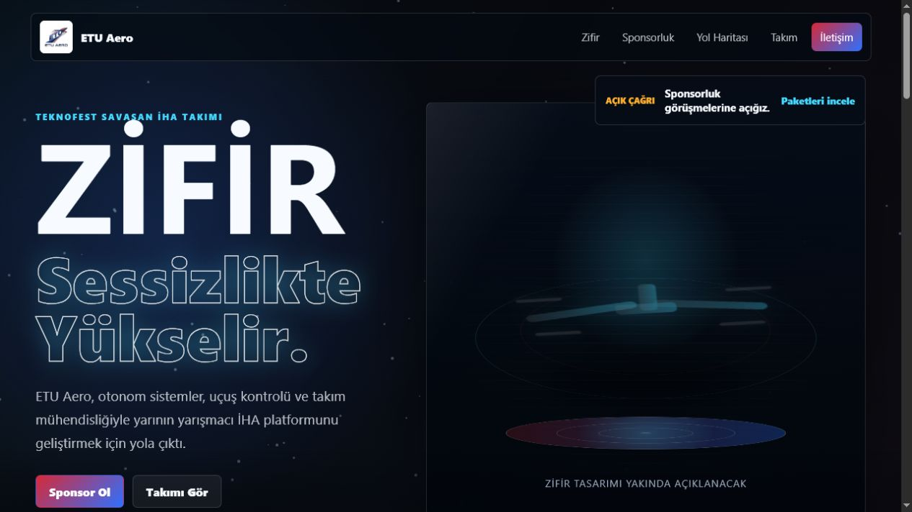
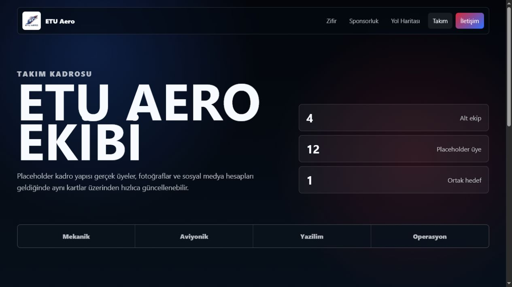
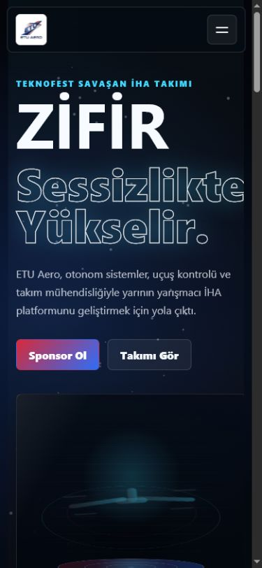

# ETU Aero Website

ETU Aero için hazırlanan statik tanıtım websitesi. Site, Teknofest Savaşan İHA kategorisine hazırlanan takımın Zifir isimli İHA projesini, sponsorluk çağrısını ve takım sayfasını öne çıkarır.

## Sayfalar

- `index.html`: Ana sayfa, Zifir sahnesi, sponsorluk alanı, yol haritası ve iletişim.
- `team.html`: Takım üyeleri için placeholder kartlar ve sosyal medya bağlantıları.
- `styles.css`: Tüm responsive tasarım, sahne görünümü ve animasyonlar.
- `script.js`: Mobil menü, scroll reveal animasyonları ve canvas arka plan efekti.

## Çalıştırma

Bu proje build gerektirmez. Dosyaları doğrudan bir statik hosting servisine yükleyebilirsiniz.

Yerelde hızlı önizleme için:

```bash
python -m http.server 5173
```

Ardından tarayıcıda `http://localhost:5173` adresini açın.

## Güncellenecek Alanlar

- `assets/etu-aero-logo.jpeg`: Takım logosu.
- `team.html`: Gerçek takım üyeleri, fotoğraflar ve sosyal medya linkleri.
- `index.html`: Sponsor paketleri, iletişim adresleri ve Zifir bilgileri.

## Ekran Görüntüleri






