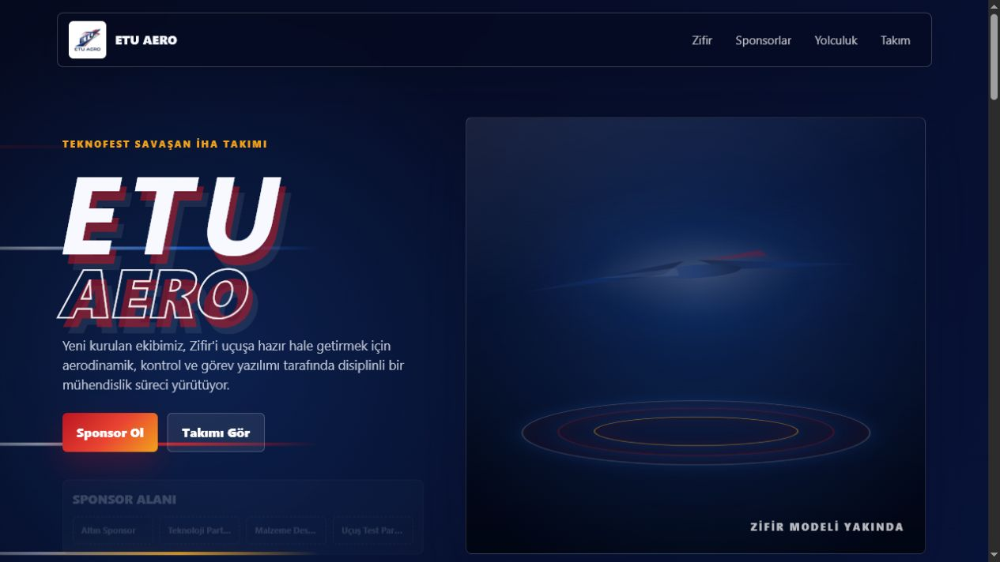

# ETU Aero Website

Statik ETU Aero takım sitesi. Build adımı veya framework bağımlılığı yoktur; bu yüzden GitHub Pages,
Netlify, Vercel veya herhangi bir statik hosting ile kolayca yayınlanabilir.

## Önizleme



## Dosyalar

- `index.html`: Ana sayfa, Zifir sahnesi, sponsor alanı ve sezon planı.
- `team.html`: Takım üyeleri ve sosyal bağlantı placeholder alanları.
- `styles.css`: Görsel sistem, responsive düzen ve animasyonlar.
- `script.js`: Scroll reveal, header durumu ve Zifir sahnesi için hafif etkileşim.
- `assets/etu_aero_logo.jpeg`: Site içinde kullanılan logo.
- `assets/readme-home.png`: README içinde kullanılan ana sayfa ekran görüntüsü.

## Yerelde Açma

Doğrudan `index.html` dosyasını tarayıcıda açabilirsiniz. İsterseniz klasörde küçük bir statik sunucu da
başlatabilirsiniz:

```bash
python -m http.server 4173
```

Ardından `http://localhost:4173` adresinden siteyi görebilirsiniz.
